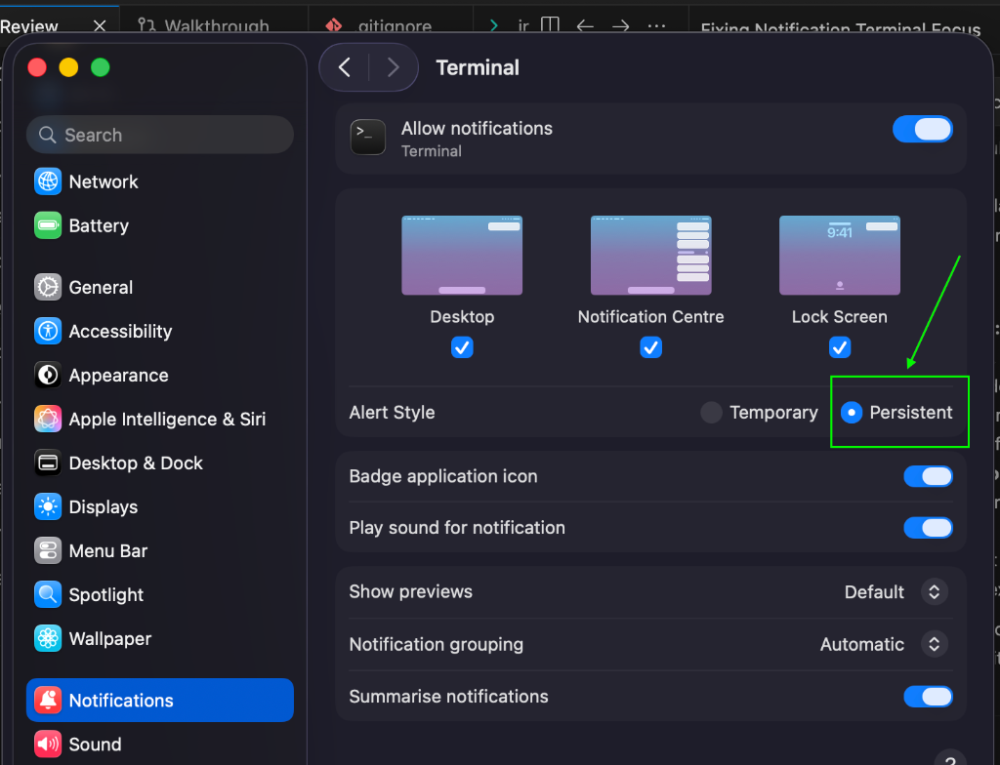

# claude-notify

Desktop notifications for Claude Code. Native macOS alerts with quick actions, instant context redirection, and zero-configuration installation.

## Features

- **100% Native macOS Alerts:** Uses the macOS Notification Center system (looks premium and fits right into your workspace).
- **Direct Action Buttons:**
  - **Finished Tasks:** Shows a direct `"Show"` button next to the standard close button.
  - **Attention Required:** Shows a direct `"Allow"` button next to the standard close button.
- **Instant Redirection:** Clicking `"Show"` or the notification body immediately activates and focuses the exact terminal shell tab running that active Claude session.
- **Allow Quick-Approval:** Clicking `"Allow"` automatically executes the return/enter keypress natively inside the active terminal tab to approve the default choice.
- **Auto-Closing Banners:** Banners are removed from your screen immediately when you click any button.
- **Multiple Session Support:** Works across any number of simultaneous Claude terminal tabs because every session's unique TTY is tracked independently.
- **Contextual Context:** Shows the project name, branch, status, and duration in the notification banner.
- **Interactive Session Dashboard (`clist`):** A fullscreen terminal selector (`clist` or `/clist`) to view all active Claude sessions, navigate using arrow keys, and:
  - **Focus Tab:** Switch instantly to that session's exact terminal window and tab.
  - **Exit Session:** Send `/exit` to close/exits Claude Code directly from the dashboard while keeping the dashboard open.
- **Zero-Configuration Installation:** Installs hooks automatically in one single command.

---

## Compatibility

- **macOS Versions:** macOS 12 (Monterey), macOS 13 (Ventura), macOS 14 (Sonoma), and macOS 15 (Sequoia).
- **CPU Architectures:** Both **Apple Silicon** (M1/M2/M3/M4 chips) and **Intel** processors.
- **Terminal Emulators:**
  - **macOS Terminal:** Full support (instantly focuses application and active tab).
  - **iTerm2:** Full support (instantly focuses application and active tab).
  - *Other terminals (WezTerm, Ghostty, Alacritty, etc.):* Focuses application window on click.

---

## Installation

Run the installation script in the root of the repository:

```bash
./install.sh
```

The script will:
1. Compile the Swift helper binary natively for your Mac CPU architecture.
2. Install the hooks and binary to `~/.claude-notify`.
3. Configure the Claude Code hooks (in `~/.claude/settings.json`) to execute notifications automatically.
4. Add shell aliases (`clist` and `/clist`) to your `~/.zshrc` and `~/.bashrc` profiles.

---

## macOS Configuration (Required)

To display buttons directly side-by-side on the notification banner without them being hidden inside a legacy `"Options"` dropdown menu, you **must** configure your terminal app's alert style to **Persistent**:

1. Open your Mac's **System Settings**.
2. Go to **Notifications** -> **Terminal** (or your active terminal app, e.g., **iTerm**).
3. Set the **Alert Style** to **Persistent** as highlighted in the screenshot below:



---

## Usage

### 1. Desktop Notifications
Once installed, the notifications trigger automatically when:
- **Task Completes:** When a long-running Claude command finishes, you will receive a notification showing the directory name, duration, and prompt context. Click **Show** to jump back to that tab.
- **Needs Attention:** When Claude needs you to approve a tool or enter permission, click **Allow** to approve it directly from the banner, or click the banner body/text to focus the terminal.

### 2. Interactive Session Dashboard
Open a new terminal tab (or reload config: `source ~/.zshrc`) and run:
```bash
clist
```
- **Navigate**: Use **Up/Down (↑/↓)** arrow keys to select a session.
- **Rename / Tag**: Press **R** on any selected session to give it a custom label (e.g. `auth-bug`, `refactor-db`).
- **Actions**: Use **Left/Right (←/→)** arrow keys to toggle between actions:
  - `◀ FOCUS ▶`: Instantly focus and switch to the session's active terminal tab (press **Enter**).
  - `◀ EXIT ▶`: Natively exits the Claude CLI in that tab and updates the dashboard (press **Enter**).
- **Exit Dashboard**: Press **Ctrl+C** or **Q** to exit.
